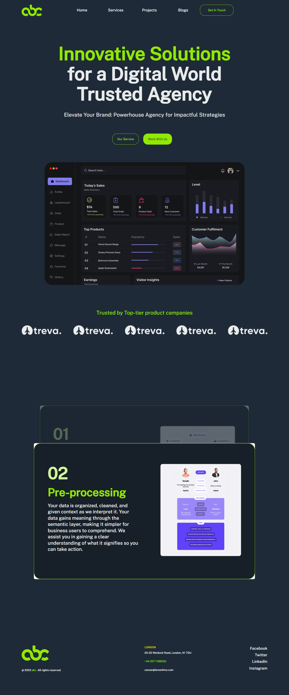
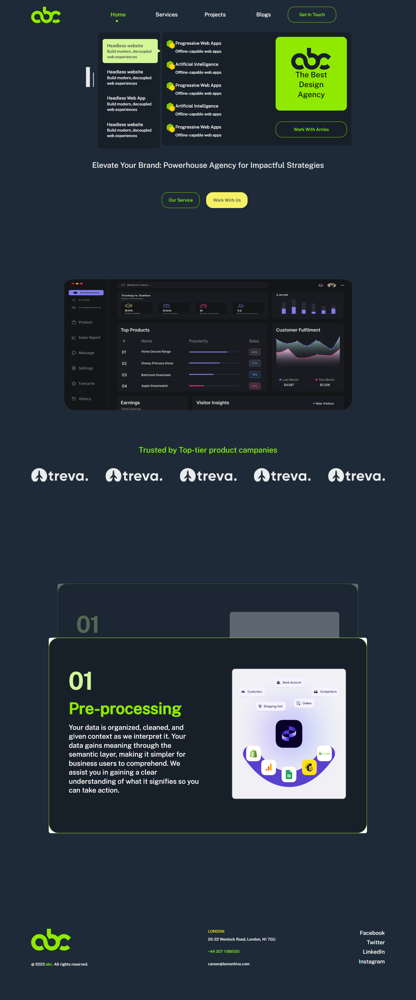

This is a [Next.js](https://nextjs.org/) project bootstrapped with [`create-next-app`](https://github.com/vercel/next.js/tree/canary/packages/create-next-app).

## Content

- [Project Dependencies](/README.md#project-dependecies)
- [Getting Started](/README.md#getting-started)
- [Custom Path Shortcuts](/README.md#custom-path-shortcuts)
- [Apollo Graphql](/README.md#apollo-graphql)

## This project template uses:

- Storybook
- Apollo Graphql
- Tailwind css
- Typescript

## Getting Started

First, run the development server:

```bash
npm run dev
# or
yarn dev
```

See the storybook

```bash
npm run storybook
# or
yarn storybook
```

Open [http://localhost:3000](http://localhost:3000) with your browser to see the result.
Open [http://localhost:6006](http://localhost:6006) with your browser to see the storybook result (tested).

## Custom Path Shortcuts

- **@src/\*** : ./src folder
- **@pages/\***: ./pages folder
- **@styles/\*** : ./styles folder
- **@root/\*** : root directory

## Some Screenshots



